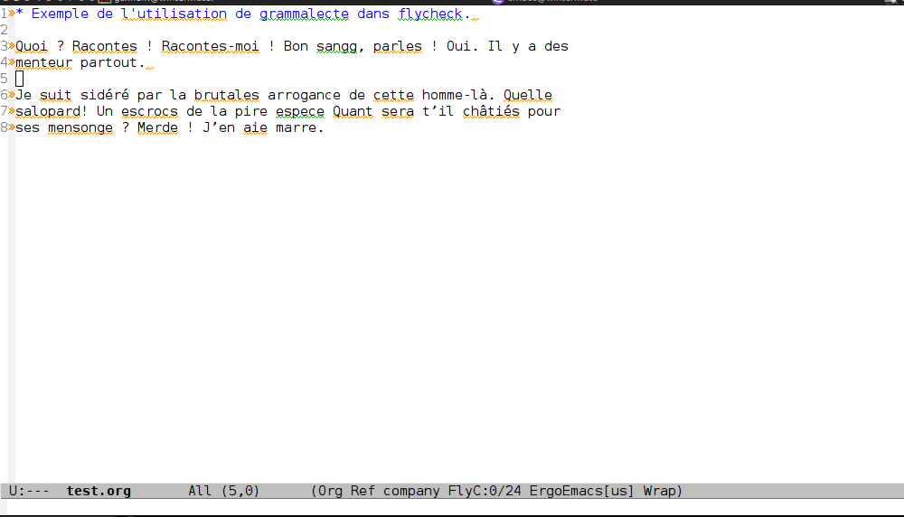

# Yet An Other Flycheck Grammalecte Fork

Forked  of : https://gitlab.com/geeklhem/flycheck-grammalecte

Simple wrapper for the french language checking
tool [Grammalecte](http://www.dicollecte.org/grammalecte/)
and the [flycheck](http://www.flycheck.org/) emacs package.

**This package is currently a quick hack-around. No particular care
has been taken to streamline the installation process. Feel free to contribute**

## Version of Grammalecte
	- Grammacalecte : 0.5.17
	- Version of dictionnary : 6.0.2
## Usage

In a org-buffer, type `M-x flycheck-mode`, `M-x flycheck-select-checker` and `francais-grammalecte`.

## TODO :
	- [X] Test it
	- [X] Change installation process
	- [X] Mettre les fichiers au claire entre ceux de grammacalecte-python et grammacalecte.el
	- [X] Vérif package process
	- [ ] Push
